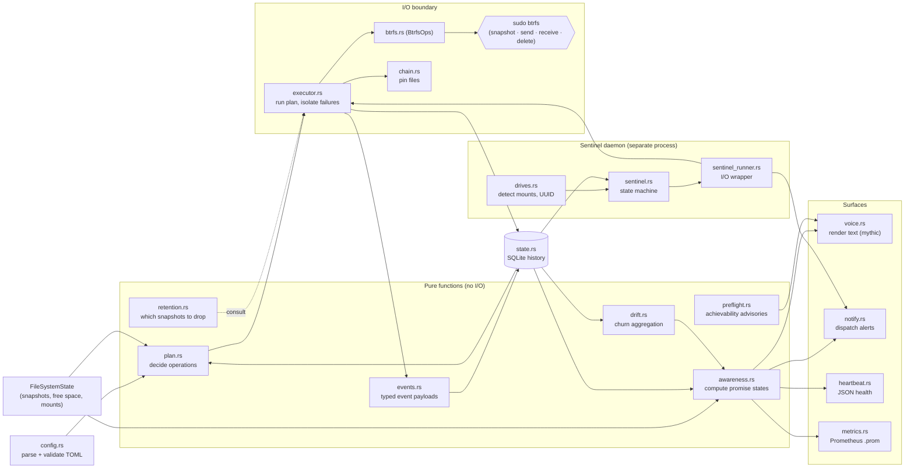

# Architecture at a Glance

> **TL;DR:** Urd is a strict pipeline — *config → plan → execute → btrfs* — with a
> ring of read-only observers (awareness, retention, drift, preflight) and a small
> set of surfaces (voice, heartbeat, Prometheus, notifications). The planner is
> pure; the executor is the only place state mutates; every btrfs call funnels
> through one trait. This page is the orientation diagram and short prose; the
> module-responsibility table in `CLAUDE.md` and the ADRs in `decisions/` are
> authoritative for the why.

**Date:** 2026-05-02
**Audience:** Both human readers and Claude sessions. One screen of orientation
before reading specific modules or ADRs.

## The flow

## How to read it

The diagram is shaped by three architectural rules. Each is load-bearing — the
ADR in parentheses is the canonical statement.

1. **The planner never modifies anything (ADR-100).** `plan.rs` is a pure function
   from `(config, FileSystemState, history)` to `Vec<PlannedOperation>`. Every
   skip/proceed decision lives there. The executor trusts the plan — it does not
   reconsider, only acts. This is why retention, drift, awareness, and preflight
   sit in the pure box: they feed the planner or the surfaces, but never mutate.

2. **Every btrfs call goes through one trait (ADR-101).** `BtrfsOps` is the only
   path to `sudo btrfs`. No other module spawns subprocesses. Tests inject
   `MockBtrfs`; production injects the real wrapper. The trait is a hard boundary
   — it makes the executor's blast radius auditable in one file.

3. **Filesystem is truth, SQLite is history (ADR-102).** Pin files and snapshot
   directories are authoritative for "what exists." The state DB records what
   happened, but a SQLite failure never blocks a backup. This is why `state.rs`
   appears as both an input and an output of the pipeline: callers persist
   best-effort records, and readers (awareness, drift, sentinel) consult them
   knowing the data may be incomplete.

The ring of pure observers feeds the surfaces without ever touching btrfs.
`awareness.rs` answers "is my data safe?"; `drift.rs` (UPI 030) aggregates churn
for the Do-No-Harm arc (ADR-113); `preflight.rs` issues advisories for
unachievable promises. None of them block — they describe.

The sentinel runs as a separate user-space systemd service. Its state machine is
pure; the runner around it is the only I/O surface. Sentinel does not race with
the timer-driven backup — the executor takes a shared advisory lock with metadata
(`lock.rs`) and the sentinel honors it.

## What the events table is for (UPI 036, ADR-114)

Prometheus owns gauges (current state over time). The `events` table in SQLite
owns typed state changes and decisions with rationale: *"retention pruned snapshot
X because daily slot was full"*, *"promise transitioned PROTECTED → AT RISK on
drive Y"*. Pure modules emit `EventPayload` values; impure callers persist them
(ADR-108). The events table is best-effort (ADR-102) and additive (ADR-105) —
schema changes never break older readers.

## What's *not* in the diagram

- **Commands** (`commands/`): one thin handler per `urd <subcommand>`. They wire
  pure modules to the I/O boundary. They contain no core logic — every decision
  delegates to the modules above.
- **Error translation** (`error.rs::translate_btrfs_error`): turns btrfs stderr
  into actionable `BtrfsErrorDetail`. Sits between btrfs.rs and the surfaces.
- **Migration** (`urd migrate`): a separate strategy that runs *before* config
  load (ADR-111). It transforms legacy TOML to v1 TOML; downstream code remains
  schema-agnostic.

## See also

- **Module responsibilities table:** `CLAUDE.md` "Module Responsibilities" — the
  authoritative one-line-per-module reference.
- **Architectural invariants:** `CLAUDE.md` "Architectural Invariants" — the
  ten load-bearing rules with ADR references.
- **Glossary:** `glossary.md` (this directory) — promise states, voice labels,
  protection levels, retention tiers, identifiers.
- **ADRs:** `decisions/ADR-100..ADR-114` — the why behind every box and edge.
