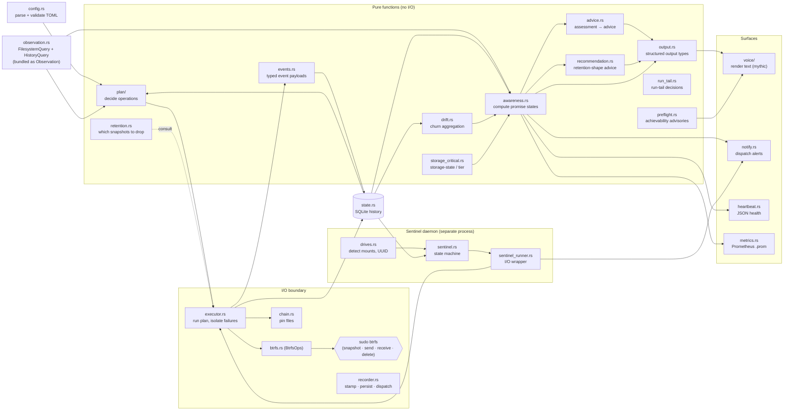

# Architecture at a Glance

> **TL;DR:** Urd is a strict pipeline — *config → plan → execute → btrfs* — with a
> ring of read-only observers (awareness, retention, drift, preflight,
> recommendation) and a small set of surfaces (voice, heartbeat, Prometheus,
> notifications). The planner is pure; the executor is the only place state
> mutates; every btrfs call funnels through one trait. This page is the
> orientation diagram, the prose that explains it, and the **authoritative
> module-responsibility table**. The ADRs in `decisions/` are authoritative for
> the *why*; the ten architectural invariants live in `CLAUDE.md`.

**Audience:** Both human readers and Claude sessions. One screen of orientation
before reading specific modules or ADRs.

## The flow

## How to read it

The diagram is shaped by three architectural rules. Each is load-bearing — the
ADR in parentheses is the canonical statement (full list of invariants in
`CLAUDE.md`).

1. **The planner never modifies anything (ADR-100).** `plan/` is a pure
   function from `(config, Observation)` to `Vec<PlannedOperation>`, where
   `Observation` bundles the filesystem-of-truth and SQLite-history query traits.
   Every skip/proceed decision lives there. The executor trusts the plan — it
   does not reconsider, only acts. This is why retention, drift, awareness,
   preflight, recommendation, and storage_critical sit in the pure box: they feed
   the planner or the surfaces, but never mutate.

2. **Every btrfs call goes through one trait (ADR-101).** `BtrfsOps` is the only
   path to `sudo btrfs`. No other module spawns subprocesses. Read-only
   generation reads go through the `BtrfsRead` supertrait (`BtrfsOps: BtrfsRead`)
   so pure planners get a non-mutating seam. Tests inject `MockBtrfs`; production
   injects the real wrapper. The trait is a hard boundary — it makes the
   executor's blast radius auditable in one file.

3. **Filesystem is truth, SQLite is history (ADR-102).** Pin files and snapshot
   directories are authoritative for "what exists." The state DB records what
   happened, but a SQLite failure never blocks a backup. This is why `state.rs`
   appears as both an input and an output of the pipeline: callers persist
   best-effort records, and readers (awareness, drift, sentinel) consult them
   knowing the data may be incomplete. The read-side split lives in
   `observation.rs`: `FilesystemQuery` for the filesystem-of-truth surface,
   `HistoryQuery` for the SQLite-history surface.

The ring of pure observers feeds the surfaces without ever touching btrfs.
`awareness.rs` answers "is my data safe?"; `advice.rs` answers "what should I do?";
`recommendation.rs` answers "what retention shape fits my headroom?"; `drift.rs`
aggregates churn for the Do-No-Harm arc (ADR-113); `storage_critical.rs` derives
storage-state tiers for the same arc; `preflight.rs` issues advisories for
unachievable promises. None of them block — they describe.

The sentinel runs as a separate user-space systemd service. Its state machine is
pure (`sentinel.rs`); the runner around it (`sentinel_runner.rs`) is the only I/O
surface. Sentinel does not race with the timer-driven backup — the executor takes
a shared advisory lock with metadata (`lock.rs`) and the sentinel honors it.

## Module responsibilities

The authoritative one-line-per-module reference. Describes each module's *role
and boundaries* — the code is the source of truth for its function inventory (see
the documentation convention in `contributing-internal.md`).

| Module | Does | Does NOT |
|--------|------|----------|
| `config.rs` | Parse TOML, validate, expand paths, resolve subvolumes | Touch filesystem beyond path checks |
| `cli.rs` | Define the `clap` command surface (argument parsing) | Contain command logic (`commands/` does that) |
| `cli_validation.rs` | CLI-boundary guards: resolve a user string to a known config name before the planner, or refuse with help | Run core logic; let unvalidated input reach the planner |
| `types.rs` | Domain types, parsing, `Display`, `derive_policy()`, `validate_protection_contract()` (the ADR-110 opacity contract) | Contain business logic |
| `plan/` | Decide what operations to run (pure function; regions with typed interfaces — `*Inputs` in, `PlanFragment` out — one module per lifecycle path, local/transient/send/external, composed by `plan()` into a single fragment); stamps each subvolume's lifecycle judgment (`PlannedLifecycle`: is_transient, clear_all, shed_away_drives) onto `BackupPlan.lifecycles` for the executor to read back | Execute anything or call btrfs |
| `executor.rs` | Execute planned operations, isolate errors per subvolume; build each `SubvolumeContext` from the plan's `PlannedLifecycle` (no tier/away-shed setters — the planner is the sole `derive_effective_policy` caller); host the gated clear-all and the `emergency_reclaim_pool` never-the-only-copy reclaim that both the watchdog abort (ADR-113 Layer 2) and the idle eject (Layer 3) reuse | Decide what to do (the planner's job); re-derive a lifecycle the plan already carries |
| `btrfs.rs` | Wrap `sudo btrfs` calls via `BtrfsOps`; read-only reads via the `BtrfsRead` supertrait (`BtrfsOps: BtrfsRead`) | Know about retention, plans, config |
| `observation.rs` | Define read-side query traits on the ADR-102 axis: `FilesystemQuery` (filesystem of truth) + `HistoryQuery` (SQLite history), bundled as `Observation` | Perform I/O (traits only); decide anything |
| `retention.rs` | Compute which snapshots to keep/delete (pure) | Delete anything (returns lists) |
| `awareness.rs` | Pure: observe promise state (PROTECTED / AT RISK / UNPROTECTED) — the "is my data safe right now?" surface | Perform I/O; translate to advice (`advice.rs`) or recommend shapes (`recommendation.rs`) |
| `advice.rs` | Pure: compose the assessment view (`assess_view` = raw assess + every product overlay — the only input surfaces render promise state from, clippy-guarded); translate an assessment into actionable advice (issue/command/reason) and redundancy advisories — the "what should the user do?" surface; the volatile product layer | Perform I/O; assess promise state (delegates to `awareness.rs`); gather signals |
| `recommendation.rs` | Pure: headroom-aware retention-shape recommendations and cost projections (ADR-115) | Perform I/O; assess promise state; mutate config; run in the backup hot path |
| `storage_critical.rs` | Pure: storage-state detection for the Do-No-Harm arc (ADR-113) — tightness tier, host-root flag, hysteresis tier resolution, per-subvolume posture, effective-policy derivation; `effective_send_interval` extracts the tier-adapted interval alone, shared by `derive_effective_policy` (planner) and awareness's read-path judgment | Perform I/O (the command layer resolves the signals at the boundary) |
| `guard.rs` | Pure do-no-harm decision cores: the mid-op watchdog (ADR-113 Layer 2) `evaluate(free_bytes, floor_bytes) -> WatchdogAction` (floor-only), and the idle emergency-eject (Layer 3) `evaluate_idle_eject(samples) -> pools below the floor`, over the shared `source_floor_bytes` floor both layers compute | Perform I/O; poll (the watchdog thread in `commands/backup.rs` and the sentinel runner sample and act) |
| `chain.rs` | Track incremental chain parents (pin files) | Send snapshots |
| `state.rs` | Record history in SQLite — granular SQL wrappers (one method per query) | Influence backup decisions; compose domain-shaped answers (callers compose primitives) |
| `preflight.rs` | Validate config achievability (pure, advisory) | Block backups |
| `heartbeat.rs` | Write JSON health signal after each run | Block backups on failure |
| `metrics.rs` | Write Prometheus `.prom` files | Read metrics |
| `notify.rs` | Compute and dispatch notifications (consumes awareness) | Decide promise states |
| `drift.rs` | Pure: rolling time-windowed churn aggregation from `drift_samples` | Perform I/O or persist |
| `rotation.rs` | Pure: infer offsite rotation cadence (median homecoming gap) and resolve the offsite freshness window from drive-mount history | Perform I/O or persist |
| `drives.rs` | Detect mounted drives, UUID fingerprinting, check space | Mount/unmount drives |
| `pools.rs` | Detect BTRFS pools, group subvolumes by pool UUID, read sysfs/statvfs utilization | Know about retention, plans, drive lifecycle, or notification policy |
| `discovery.rs` | Build the zero-state `SystemInventory` (pools, mounted subvolumes, candidate drives with internal/external class + LUKS state, typed notes) from unprivileged probes — `lsblk -J`/`findmnt -J` parsing, per-disk signal aggregation; observational only | Use sudo or `BtrfsOps`; read config or state DB; vouch for device identity to privileged consumers (they re-verify at action time) |
| `strategy.rs` | Pure: derive a `ProposedStrategy` from `SystemInventory` + `FateAnswers` — promises on the named levels, drive roles, `derive_policy()` retention shapes, typed `Gap`s and intention strings; owns the shared candidate/destination rules the Encounter's question list is built from (positive-evidence pool residency, ask-don't-guess) | Produce `Config` or TOML (config generation owns conversion); ask questions or render (conversation/voice own those); derive `fortified` or `custom`; perform I/O |
| `config_render.rs` | Pure: convert an approved `ProposedStrategy` into the internal `Config` normal form and hand-render it as fully explicit, commented v2 TOML (`generate_config`, the single entry) — anchored intention comments, typed exclusion block, gap commentary, tool-agnostic header | Perform I/O or write files (`commands/encounter.rs` owns the self-check + atomic no-clobber publish); parse configs (`config.rs` owns the tri-parser); derive strategies; render conversation or mythic voice |
| `encounter.rs` | Pure state machine for the Fate Conversation (`begin`/`advance` → typed `Effect`s: prompt, look, carve, farewell — discovery is *requested* via `Effect::Look`, never performed here) — question queues derived from `strategy.rs`'s candidate/destination rules (question economy by construction), input parsing against the live prompt's choice vector, and the composed views (`LookingView`, `RunestoneView`, `EmptyView`) the renderer consumes | Perform I/O (`commands/encounter.rs` owns stdin, discovery, clock, carve, the editor loop); render text (`voice/encounter.rs`); derive strategies or generate configs (it calls, never reimplements) |
| `sudoers.rs` | Pure: render the scoped `/etc/sudoers.d/urd` grant from `Config` (`render_sudoers`, the single oracle) — creation/deletion lines per source/snapshot-root pair, broad send/receive, read-only diagnostics; refuses hostile config values (control chars, `#`, non-UTF-8, a scope floor that blocks shallow paths) rather than escaping them; also the drift oracle's granted side — parses `sudo -n -l` output (`parse_privilege_listing`), three-state `coverage`, and `classify_probe` | Perform I/O; install or write the sudoers file (`commands/seal.rs` does that); prompt for consent |
| `systemd_units.rs` | Pure: the units oracle — render the expected systemd user units from the embedded repo `systemd/` files (`expected_units`: cadence-selected set, ExecStart substituted with the resolved binary path, hostile paths refused rather than escaped) and diff installed contents against them (`diff_units`); serves the seal's install and doctor's drift advisory from one render | Perform I/O; write or enable units (`commands/seal.rs` does that); talk to systemctl |
| `commands/seal.rs` | Thin I/O: `resume_seal` — the seal's stages in order, each behind an idempotent done-check: the earning (staged fail-closed sudoers install + probe/coverage cross-check), drive adoption, units install+enable with consent + the linger truth, first local snapshot and first-send offer (both through `backup::run`), the privileged second look (subvol-path-space classification), the summary scroll; hosts the shared seal seams other surfaces call (`probe_grant`, plus the two gap gates that own the privilege→units→first-thread order: `seal_posture` — the cheap existence-level probe for status surfaces, also carrying whether the machine is earned and whether the probe itself couldn't confirm the grant — and `seal_gap_deep` — `urd init`'s content-level gate, which also sees definitively-missing sudoers coverage and units content drift) | Decide grant or unit content (`sudoers.rs` / `systemd_units.rs` do that); plan or execute backups (it invokes the pipeline); render prompts or mythic voice |
| `output.rs` | Define structured output types | Render text (`voice/` does that) |
| `voice/` | Render structured output as mythic-voice text; per-command sub-modules, with cross-renderer helpers in `voice/mod.rs` exposed `pub(super)` | Perform I/O or compute state |
| `voice_events.rs` | Per-variant `EventPayload` renderer (columnar + NDJSON) | Perform I/O or query state |
| `voice_contract.rs` | Encode the seven-rule voice contract as in-tree tests | Render or compute (test-only) |
| `events.rs` | Pure: `Event`, `EventKind`, `EventPayload`, `Severity`, typed payload enums; the emit-side stamp machinery (`UnstampedEvent`, `RunContext`) — `Event::pure` returns an `UnstampedEvent`, so emitter output cannot reach persistence without a run context | Perform I/O |
| `recorder.rs` | Own the ADR-114 dance: stamp every event with the caller's `RunContext`, persist best-effort (ADR-102 semantics inside — a missing/failed DB never suppresses a notification), dispatch per `DispatchPolicy::{Immediate, GateOnSentinel}` (the gate owns probe → dispatch-or-mark → sentinel-retry mechanics). The default sentinel probe references `sentinel_runner::sentinel_is_running` — a deliberate intra-crate reference pair (sentinel_runner constructs recorders at its flush sites); do not "fix" it by making every constructor pass the probe, that reintroduces the per-site convention this seam kills | Compute notification content (pure builders do); decide what to emit (emitters do); query state; own event-less notices (the sentinel's drive notices stay direct `notify::dispatch`, marked at each site) |
| `run_tail.rs` | Pure: the run-tail decisions for `backup::run`'s closing sequence — `decide_tail` called by BOTH exits (`TailExit::{EmptyPlan, Executed}` → metrics spec, built heartbeat, the single sentinel-gate recording, transitions, promise-diff recording, exit verdict, as one truth table), the `decide_reclaim`/`firing_recordings` watchdog-teardown sandwich (same-fs vs cross-fs routing, table-testable without tripping a watchdog; act-time `fresh_away_map`/reclaim I/O threads around it in the adapter), `offsite_recordings`, and transition detection; owns the tail's data bundles (`PoolObservability`, `WatchdogFiring`) | Perform I/O or read a clock (the adapter gathers and supplies timestamps); own thread wiring (watchdog/progress/ctrl-c stay in `commands/backup.rs`); compute notification content (`notify` builders do); persist or dispatch (`recorder.rs` does) |
| `lock.rs` | Shared advisory lock with metadata (PID, trigger source) | Decide whether to proceed (the caller's job) |
| `sentinel.rs` | Pure state machine for the Sentinel daemon (events, actions, circuit breaker) plus the idle emergency-eject protocol (ADR-113 Layer 3, `eject_transition`: ~60 s timer gate, eject verdict, backup deferral, re-confirm-under-lock sequencing) | Perform I/O (`sentinel_runner.rs` does that) |
| `sentinel_runner.rs` | I/O wrapper around the Sentinel state machine — the daemon's only I/O surface; for the idle emergency eject (the daemon's sole filesystem-mutating action) it samples pool pressure and executes the protocol's effects (lock, statvfs re-confirm, reclaim, surfacing) | Make state-machine decisions (`sentinel.rs` does that — the eject protocol included) |
| `error.rs` | Error types; `translate_btrfs_error()` for actionable messages | Recovery logic |
| `commands/world.rs` | The observed-world prelude: `World::open` owns the best-effort `StateDb` + read-only `RealBtrfs`; Layer 1 `world.view()` returns an owned `WorldView { signals, assessments }` for `status`/`default`/`doctor`; Layer 2 `world.fs()`/`world.observation()` serve `plan_cmd`/`backup`, which hold the `Observation` for their own timing; the sole sanctioned production door onto `advice::assess_view` (clippy `disallowed-methods` guard) via `world::assess` | Compute or decide anything; cache signals across calls |
| `commands/` | CLI subcommand handlers (wire pure modules to I/O) | Core logic (delegate to the modules above) |

## What the events table is for (ADR-114)

Prometheus owns gauges (current state over time). The `events` table in SQLite
owns typed state changes and decisions with rationale: *"retention pruned snapshot
X because daily slot was full"*, *"promise transitioned PROTECTED → AT RISK on
drive Y"*. Pure modules emit `EventPayload` values; impure callers persist them
(ADR-108). The events table is best-effort (ADR-102) and additive (ADR-105) —
schema changes never break older readers.

## What's *not* in the diagram

- **Commands** (`commands/`): one thin handler per `urd <subcommand>`. They wire
  pure modules to the I/O boundary. They contain no core logic — every decision
  delegates to the modules above.
- **Error translation** (`error.rs::translate_btrfs_error`): turns btrfs stderr
  into actionable `BtrfsErrorDetail`. Sits between btrfs.rs and the surfaces.
- **Migration** (`urd migrate`): a separate strategy that runs *before* config
  load (ADR-111). It transforms legacy/v1 TOML to v2 TOML; downstream code remains
  schema-agnostic.

## See also

- **Architectural invariants:** `CLAUDE.md` "Architectural Invariants" — the ten
  load-bearing rules with ADR references.
- **Glossary:** `glossary.md` (this directory) — promise states, voice labels,
  protection levels, retention tiers, identifiers.
- **ADRs:** `decisions/` — the why behind every box and edge.
